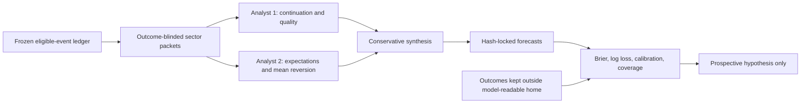

# LLM event-edge research

This folder is a rerunnable, leakage-aware pilot for asking whether an LLM adds calibrated forecasting information around company events. It is deliberately separate from the production position-sizing simulator.

The current study contains 326 unique U.S.-listed earnings cases from June 15 through August 14, 2026. Cases are scored through 12 sector views; pharma/biotech intentionally overlaps health care. Strict eligibility produced 19 materials cases and 26 communication-services cases; the other core views have at least 30, and health care has 41 because of the overlay.

## What this pilot can establish

- Whether the forecast graph is internally coherent and operationally reproducible.
- Whether outcome-blinded packet forecasts show exploratory calibration or directional skill.
- Which sector/event/horizon hypotheses deserve immutable prospective testing.
- Which data fields, timestamps, and quote captures a future executable study requires.

It cannot establish live alpha. The cohort was selected with a post-event reconstructed screener, the current model generated the forecasts retrospectively, and there are no timestamped executable option quotes. Live recommended position size remains zero until the prospective gates in [POSITION_SIZING_POLICY.md](POSITION_SIZING_POLICY.md) pass.

## Strategy arms

The user-supplied examples motivated three separate hypotheses. They must not be pooled or assigned a winning horizon after observing the result.

1. **Pre-earnings catalyst:** information and order cutoff measured in hours before a scheduled release; primary outcome is the first regular-session close after the release.
2. **Short catalyst:** decision one to five trading days before a named event; fixed one- and ten-session outcomes.
3. **Oversold fundamental rebound:** a valuation/growth-continuation thesis with predeclared 10-, 20-, or 40-session outcome. The current two-month event cohort has almost no mature 40-session outcomes.

Private seed cases belong in `hypotheses/user-seed-cases.json`. That ignored file is never counted as validation evidence without the complete original eligible universe, including rejected and losing names.

`npm run edge:audit-seeds` refreshes a descriptive close-to-close audit for U.S.-listed private seeds. Its ignored output is selected-case context only, never an edge estimate.

## Forecast graph



Each Codex node runs from a temporary directory with web search disabled. On macOS, Seatbelt denies the original home directory and prevents subprocess execution other than the native Codex process. Node outputs are schema-validated, cached with their prompt/schema/CLI provenance, and rejected if nested probabilities are incoherent.

## Commands

Prerequisites are Node.js 22.12 or newer, an authenticated Codex CLI, and a truthful SEC user-agent for new ingestion:

```bash
export SEC_USER_AGENT='YourResearchApp your-contact@example.com'
npm ci
npm run edge:ingest
npm run edge:packets
npm run edge:forecast
npm run edge:score
```

Use `npm run edge:refresh-outcomes` after increasing `outcomeObservationDate` in `config.json`. That command refreshes settlements for the frozen cohort without rebuilding packets or changing forecasts.

Quality gates:

```bash
npm run edge:typecheck
npm run edge:test
npm run edge:lint
npm run edge:format:check
```

## Data policy

- `data/raw/`, `data/private/`, and `data/forecasts/` are ignored.
- Public artifacts contain derived case identifiers, aggregate manifests, response hashes, and reports—not provider payloads or private chat history.
- Version-one source snapshots did not retain trustworthy per-response retrieval timestamps. The manifest nulls those fields instead of presenting a planned time as an observed time. Future ingestion records completion time directly.

See [STRATEGY_RECOMMENDATIONS.md](STRATEGY_RECOMMENDATIONS.md) for the proposed
sector/event/horizon program, [STUDY_V2_DECISION.md](STUDY_V2_DECISION.md) for
the volatility-baseline verdict, [clinical-trials/README.md](clinical-trials/README.md)
for the clinical-readout arm, [OPTIONS_DATA_PLAN.md](OPTIONS_DATA_PLAN.md) for
the executable OTM design, [METHODOLOGY.md](METHODOLOGY.md) for target
definitions and limitations, [SOURCES.md](SOURCES.md) for provenance, and
[the completed pilot report](data/PILOT_RESULTS.md) with its public
[case](data/pilot-case-index.jsonl) and
[forecast](data/pilot-forecast-index.jsonl) indexes.

Additional reproducible diagnostics:

```bash
npm run edge:audit-volatility
npm run edge:validate-clinical
```

The first command reconstructs point-in-time RV20 for all 241 mature ten-day
cases and compares the LLM descriptively with Gaussian, walk-forward, and
purged return-window cross-fitted volatility-only forecasts. It deliberately
omits inferential p-values and confidence intervals because the returns overlap
and the cohort spans only 23 event dates. Raw Nasdaq responses remain ignored;
their URL, timestamp provenance, and hashes are bound by a public source
manifest (with older cache mtimes explicitly distinguished from exact fetch
times), and
derived aggregate results are in
[`data/VOLATILITY_BASELINE_AUDIT.md`](data/VOLATILITY_BASELINE_AUDIT.md).
